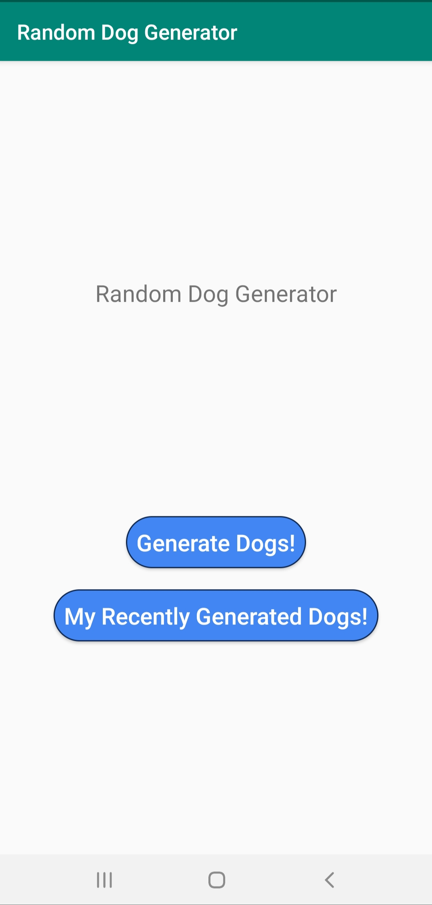

# RandomDogsGenerator

This is a sample project to demostrate use of  various  components of Android.

## Project characteristics

This project brings to table set of best practices, tools, and solutions:

* 100% [Kotlin](https://kotlinlang.org/)
* Modern architecture (Clean Architecture, Model-View-ViewModel, Model-View-Intent)
* [Android Jetpack](https://developer.android.com/jetpack)
* A single-activity architecture, using the [Navigation component](https://developer.android.com/guide/navigation/navigation-getting-started)

## Tech-stack

Min API level is set to [`21`](https://android-arsenal.com/api?level=21), so the presented approach is suitable for over
[85% of devices](https://developer.android.com/about/dashboards) running Android. This project takes advantage of many
popular libraries and tools of the Android ecosystem. Most of the libraries are in the stable version unless there is a
good reason to use non-stable dependency.

* Tech-stack
    * [Kotlin](https://kotlinlang.org/) + [Coroutines](https://kotlinlang.org/docs/reference/coroutines-overview.html) - perform background operations
    * [Retrofit](https://square.github.io/retrofit/) - networking
    * [Jetpack](https://developer.android.com/jetpack)
        * [Navigation](https://developer.android.com/topic/libraries/architecture/navigation/) - deal with whole in-app navigation
        * [LiveData](https://developer.android.com/topic/libraries/architecture/livedata) - notify views about database change
        * [Lifecycle](https://developer.android.com/topic/libraries/architecture/lifecycle) - perform an action when lifecycle state changes
        * [ViewModel](https://developer.android.com/topic/libraries/architecture/viewmodel) - store and manage UI-related data in a lifecycle conscious way
* Architecture
    * MVVM + MVI (presentation layer)
    * [Android Architecture components](https://developer.android.com/topic/libraries/architecture) ([ViewModel](https://developer.android.com/topic/libraries/architecture/viewmodel), [LiveData](https://developer.android.com/topic/libraries/architecture/livedata), [Navigation](https://developer.android.com/jetpack/androidx/releases/navigation))

* Gradle
    * [Gradle Kotlin DSL](https://docs.gradle.org/current/userguide/kotlin_dsl.html)

## Architecture

The modularized code-base approach provides few benefits:
- better [separation of concerns](https://en.wikipedia.org/wiki/Separation_of_concerns). Each module has a clear API., Feature related classes life in different modules and can't be referenced without explicit module dependency.
- features can be developed in parallel eg. by different teams
- each feature can be developed in isolation, independently from other features
- faster compile time

#### Presentation layer

This layer is closest to what the user sees on the screen. The `presentation` layer is a mix of `MVVM` (Jetpack `ViewModel` used to preserve data across activity restart) and
`MVI` (`actions` modify the `common state` of the view and then new state is edited to a view via `LiveData` to be rendered).

> `common state` (for each view) approach derives from
> [Unidirectional Data Flow](https://en.wikipedia.org/wiki/Unidirectional_Data_Flow_(computer_science))

Components:
- **View (Fragment)** - presents data on the screen and pass user interactions to View Model. Views are hard to test, so they should be as simple as possible.
- **ViewModel** - dispatches (through `LiveData`) state changes to the view and deals with user interactions (these view models are not simply [POJO classes](https://en.wikipedia.org/wiki/Plain_old_Java_object)).
- **ViewState** - common state for a single view
- **NavManager** - singleton that facilitates handling all navigation events inside `NavHostActivity` (instead of separately, inside each view)

#### Domain layer

This is the core layer of the application. Notice that the `domain` layer is independent of any other layers. This allows to make domain models and business logic independent from other layers.
In other words, changes in other layers will have no effect on `domain` layer eg. changing database (`data` layer) or screen UI (`presentation` layer) ideally will not result in any code change withing `domain` layer.

Components:
- **UseCase** - contains business logic
- **DomainModel** - defies the core structure of the data that will be used within the application. This is the source of truth for application data.
- **Repository interface** - required to keep the `domain` layer independent from the `data layer` ([Dependency inversion](https://en.wikipedia.org/wiki/Dependency_inversion_principle)).

#### Data layer

Manages application data and exposes these data sources as repositories to the `domain` layer. Typical responsibilities of this layer would be to retrieve data from the internet and optionally cache this data locally.

Components:
- **Repository** is exposing data to the `domain` layer. Depending on application structure and quality of the external APIs repository can also merge, filter, and transform the data. The intention of
these operations is to create high-quality data source for the `domain` layer, not to perform any business logic (`domain` layer `use case` responsibility).

- **Mapper** - maps `data model` to `domain model` (to keep `domain` layer independent from the `data` layer).
- **RetrofitService** - defines a set of API endpoints.
- **DataModel** - defines the structure of the data retrieved from the network and contains annotations, so Retrofit (Moshi) understands how to parse this network data (XML, JSON, Binary...) this data into objects.

## Application flow

Below diagram presents application app flow when a user interacts with the application:

          

## Design decisions

Read related articles to have a better understanding of underlying design decisions and various trade-offs.

* [Multiple ways of defining Clean Architecture layers](https://proandroiddev.com/multiple-ways-of-defining-clean-architecture-layers-bbb70afa5d4a)
* [How to Develop a Secure Android App](https://medium.com/@amritlalsahu5/how-to-develop-a-secure-android-app-b4ec103ece8c)
* [All about Memory Leaks in Android](https://medium.com/@amritlalsahu5/all-about-memory-leaks-in-android-7c0e5c8d679c)
* [Android Navigation Architecture Component](https://medium.com/@amritlalsahu5/using-android-navigation-architecture-component-9c52a1e92c19)

## Getting started

There are a few ways to open this project.

### Android Studio

1. Android Studio -> File -> New -> From Version control -> Git
2. Enter `https://github.com/amritlalsahu5/RandomDogsGenerator.git` into URL field

### Command-line + Android Studio

1. Run `git clone https://github.com/amritlalsahu5/RandomDogsGenerator.git`
2. Android Studio -> File -> Open

## Author

[Github](https://github.com/amritlalsahu5) 
[Medium](https://medium.com/@amritlalsahu5)

